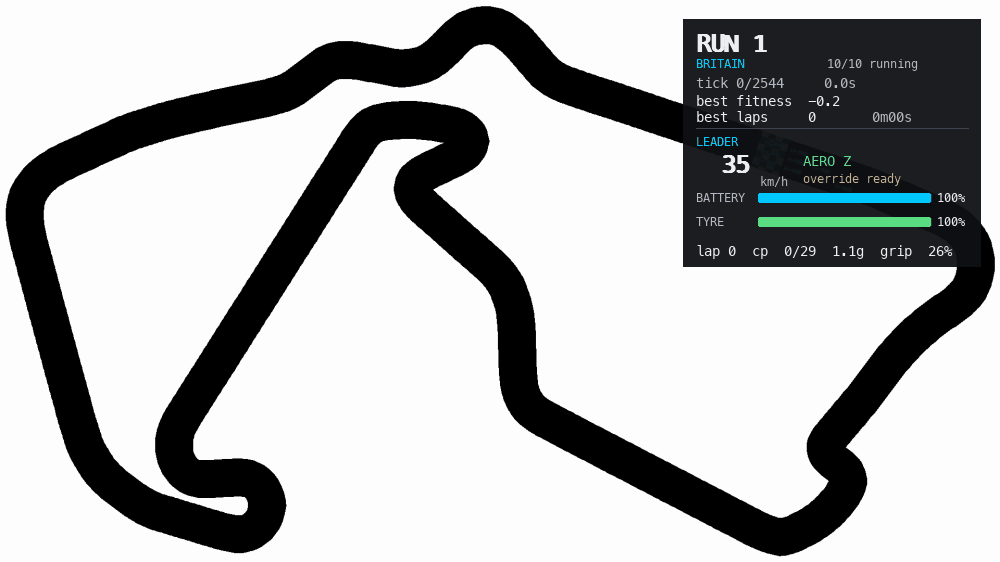
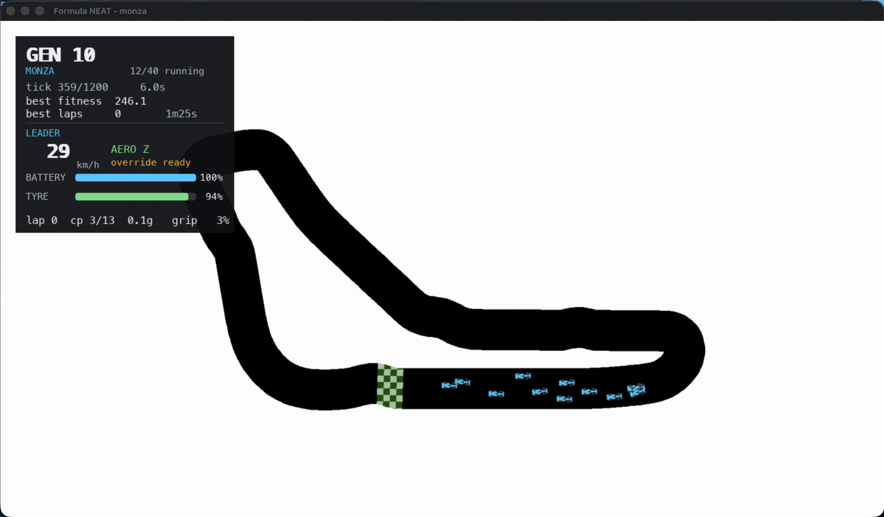

# Formula NEAT

NEAT self-driving cars racing under simplified 2026 F1 mechanics — active aero,
battery deployment, manual override, tyre wear, and a grip model that crashes a
car when it asks more of the tyres than they have — on 18 real Formula 1
circuits built from actual track geometry.



*Ten copies of one trained network through Becketts at Silverstone, with live
telemetry: speed, lateral g, how much of the available grip is being used,
battery drain and tyre wear. Recorded with `--record`, below.*

<details>
<summary>The same thing running in a window, on Monza</summary>



</details>

## Quick start

```powershell
pip install pygame neat-python

python main.py                       # train on the oval, with a window
python main.py --track britain       # Silverstone
python main.py --headless -g 200     # train fast, no rendering
python main.py --replay best_oval.pkl
```

The best genome of a run is written to `best_<track>.pkl` whenever it improves.
The file records the score it earned, and a later run will not overwrite it with
anything worse — delete it, or pass `--save-best`, to start a fresh record.

### Recording

```powershell
python main.py --track britain --replay best_britain.pkl --headless ^
  --replay-cars 10 --record demo.gif --record-seconds 9
```

`--record` writes an animated GIF of a training run or a replay. With
`--headless` it renders to an offscreen canvas, so a clip is captured as fast as
the machine manages rather than in real time. `--record-every`, `--record-width`
and `--record-seconds` control the rest. Recording needs Pillow; the simulation
itself does not.

While a window is open:

| key     | effect                                          |
| ------- | ----------------------------------------------- |
| `Esc`   | quit                                            |
| `Space` | end the current generation                      |
| `D`     | debug overlay: radars, racing line, checkpoints |
| `H`     | hide the telemetry panel                        |
| `1`-`5` | run 1-5 simulation ticks per drawn frame        |

## Tracks

18 circuits from the 2026 calendar, plus two synthetic ones.

| track | circuit | lap | band | car |
| --- | --- | --- | --- | --- |
| `australia` | Albert Park | 4983px | 91px | 42x15px |
| `china` | Shanghai International Circuit | 6178px | 48px | 23x8px |
| `bahrain` | Bahrain International Circuit | 6754px | 74px | 34x12px |
| `spain` | Circuit de Barcelona-Catalunya | 6514px | 70px | 34x12px |
| `austria` | Red Bull Ring | 5751px | 88px | 42x15px |
| `britain` | Silverstone | 6025px | 72px | 34x12px |
| `belgium` | Spa-Francorchamps | 5394px | 64px | 31x11px |
| `hungary` | Hungaroring | 4825px | 70px | 34x12px |
| `netherlands` | Zandvoort | 5331px | 30px | 20x7px |
| `monza` | Autodromo Nazionale Monza | 4756px | 92px | 42x15px |
| `madrid` | Madring | 5301px | 49px | 23x8px |
| `singapore` | Marina Bay Street Circuit | 6237px | 42px | 20x7px |
| `usa` | Circuit of the Americas | 5677px | 63px | 28x10px |
| `mexico` | Autodromo Hermanos Rodriguez | 4732px | 62px | 28x10px |
| `brazil` | Interlagos | 7290px | 84px | 39x14px |
| `las_vegas` | Las Vegas Strip Circuit | 5282px | 88px | 42x15px |
| `qatar` | Losail International Circuit | 5725px | 80px | 37x13px |
| `abu_dhabi` | Yas Marina Circuit | 5834px | 59px | 28x10px |
| `oval` | hand-drawn oval | 4029px | 129px | 62x22px |
| `monza_art` | from the outline art in `assets/tracks/` | 2664px | 96px | 45x16px |

### Six circuits are missing, and here is why

A real Formula 1 circuit is about **480 times longer than it is wide**. Draw a
5 km lap as ~5000 pixels and a *realistic* track band is about **10 pixels**
across — too narrow to drive, and narrower than the car. Every track here is
therefore painted four to nine times wider than reality on purpose.

Six circuits are where that runs out of road:

| circuit | why |
| --- | --- |
| **Suzuka** | a figure-of-eight. It crosses over itself, so it has no infield and cannot be a ring in 2D at all. |
| **Monaco**, **Baku**, **Jeddah**, **Montreal**, **Miami** | genuinely run alongside themselves — Monaco's minimum clearance between non-adjacent sections is about 13 m. Widening the band enough to drive welds those sections into one blob and short-circuits the lap. |

`tools/build_tracks.py` detects this: it caps the band at the circuit's own
self-clearance, then checks the painted result still reproduces the source lap
length, and skips the track with a reason rather than emitting a broken one.

### How a track is built

A track is an image plus a JSON file. The image is white where the car crashes
and non-white where it can drive.

```powershell
python tools/fetch_circuits.py    # real centrelines -> assets/tracks/geo/
python tools/build_tracks.py      # -> track images + JSON
python tools/preview_track.py britain
```

Geometry comes from [bacinger/f1-circuits](https://github.com/bacinger/f1-circuits)
as closed WGS84 centrelines; measured against the official lap lengths they are
accurate to under 1%. Those GeoJSON files are committed, so builds work offline.

The builder projects each circuit to metres, rotates it to whichever orientation
fills a 16:9 frame largest, paints a band along it, and then derives everything
else **from the painted image**: it cuts the ring open, releases a breadth-first
wavefront around it, and takes each wavefront's centroid as a centreline point —
which also puts them in lap order. From that come the racing line, evenly spaced
checkpoints sized to the local track width, corner apexes, a start/finish line,
and a spawn on the longest straight.

Deriving beats placing by hand: the checkpoints originally shipped in
`monza.json` had 9 of 12 sitting off the track and the spawn point in the
infield.

Each track also gets a **clearance field** — a greyscale image of how far every
pixel is from a wall. The radars ray-march through it (see below).

## Scale: what is real and what is not

This is the part worth understanding, because the honest answer is a trade-off.

**Real:** the car is a 5.63 m × 2.00 m Formula 1 car, every track is about six
cars wide and 2.1 car-lengths wide — the true proportion — and the physics runs
at 320 km/h with ~4.4 g of lateral grip on a 768 kg car.

**Not real:** the lap. Monza is drawn as 4756px, and at that track's scale that
is 638 m rather than 5793 m. As above, a realistic lap length and a visible car
cannot coexist in one 1920×1080 frame.

Because the car is sized from each track's own band, **every track has its own
metre scale** — a pixel is 0.09 m on the oval and 0.24 m on Shanghai. So the
physics in `sim_config.py` is written in real units and converted per track by
`cfg_for_track()`. The result is that the same car behaves identically
everywhere: 320 km/h flat out on every circuit, corners at 93–109 km/h, and only
the geometry differs.

```
python tools/calibrate.py britain
  lap 6025px = 998m, band 72px (6.04 cars), car 34x12px, 0.1656 m/px
  top speed  Z 8.9px/tick (320 km/h)   X 9.7px/tick (346 km/h)
  tightest corner (r=89px) on fresh Z: 2.78px/tick (99 km/h) - limited by grip
  tightest corner (r=89px) on fresh X: 2.48px/tick (89 km/h) - limited by grip
  tightest corner (r=89px) on worn  Z: 2.13px/tick (76 km/h) - limited by grip
```

## Layout

| file | role |
| --- | --- |
| `main.py` | training loop, rendering, telemetry HUD, replay |
| `car.py` | the car: physics, sensors, power unit, per-tick fitness |
| `sim_config.py` | real-world physics constants, and the per-track conversion |
| `track.py` | track image, collision mask, clearance field, starting grid |
| `config.txt` | NEAT settings for the current model (13 in, 5 out) |
| `tools/fetch_circuits.py` | download real circuit centrelines |
| `tools/build_tracks.py` | turn geometry or art into a drivable track + metadata |
| `tools/preview_track.py` | draw that metadata over the image, to check it |
| `tools/calibrate.py` | what the physics constants mean on a real track |
| `recorder.py` | GIF capture for `--record` (needs Pillow) |
| `newcar.py` | the original baseline, frozen (see below) |
| `config_baseline.txt` | NEAT settings for that baseline (5 in, 6 out) |

## 2026 rules modeled

Gameplay approximations, not an FIA-accurate physics model.

**Active aerodynamics (X / Z).** Z is the default, high-downforce mode. X trades
downforce for straight-line speed: +26 km/h, but 28% less grip and duller
steering. Taking a corner in X at speed ends the lap.

**Manual override, not DRS.** Overtake assistance is an electrical boost that
only unlocks within 22 m of another car, and drains the battery about three
times as fast as normal deployment.

**Power unit split.** Roughly half the acceleration comes from the engine and
half from electrical deployment, so a flat battery costs real lap time. Braking
and lifting harvest it back.

**Tyres.** Grip decays with distance and speed, to about 45% of fresh over a long
stint, lowering the speed the car can carry through a corner.

### Cornering

`car.py` estimates a turn radius from the steering angle with a bicycle model,
computes the centrifugal force on a 768 kg car at that radius, and crashes it if
that exceeds the grip available from the tyres and the current aero mode. In
practice this is a speed-versus-steering envelope: the faster you go, the less
you may turn.

## Network

13 inputs:

| index | input |
| --- | --- |
| 0-4 | radar distances from the nose at -90, -45, 0, +45, +90 degrees |
| 5 | speed, as a fraction of maximum |
| 6 | tyre grip |
| 7 | battery charge |
| 8 | aero mode (1 = X) |
| 9 | override available |
| 10 | cornering load, as a fraction of the grip limit |
| 11-12 | distance and heading error to the next checkpoint |

5 continuous outputs, `tanh`-squashed: steering (-1..+1), throttle, brake, aero
mode (positive selects X), override request. This replaces the baseline's
pick-one-of-six discrete actions, so a car can brake and steer at once.

## Fitness

Scored per tick in `Car.update`, with every weight in `sim_config.py`:

| term | weight |
| --- | --- |
| checkpoint reached, in order | **+18** |
| lap completed | **+220** |
| corner apex hit | **+2.2** |
| on the racing line | **+0.30**, fading to 0 at 42% of track width, negative beyond |
| pace | **+1.0 × (speed / top speed)** |
| battery above 35% | **+0.05** |
| battery below 12% | **−0.35** |
| every tick | **−0.50** |
| steering | **−0.01 × \|steer\|** |

`main.py` also retires a car that has not reached a checkpoint in
`--stall-ticks` (260 by default), *plus* however long its grid slot needs to
reach the line.

**Why these weights.** The original ones paid **2.08 per tick just for existing
on the racing line** — 2495 over a generation — while a whole lap paid 580.
Crawling strictly dominated racing, and training converged on exactly that: the
best car after 50 generations drove at 29 km/h and never completed a lap. The
per-tick terms now sum to less than the per-tick penalty, so a car has to cover
ground to score at all.

## Baseline

`newcar.py` is the original discrete-action version, kept runnable for
comparison. It has its own inline car class, its own 5-input NEAT config, and
simpler rules. It is frozen — new work goes in `car.py` and `main.py`.

```powershell
python .\newcar.py
```

## Notes on the implementation

Things that were wrong, or are worth knowing.

**Sprite rotation crashed the simulation.** `rotate_center` cropped the rotated
sprite back to the unrotated rectangle, impossible past about 45 degrees — a
rotated 34×16 car is only 16px wide at 90 degrees — so it raised `ValueError` on
the first real steering input. It now keeps the whole rotated image, and
`sprite_rect()` re-centres it; the collision mask uses the same rectangle.

**Radars ray-march.** Walking a ray pixel by pixel, recomputing `sin`/`cos` per
pixel, was the most expensive thing in the simulation. Striding a fixed 4px
instead was 3× faster but *wrong*: at glancing angles it straddled walls and
reported the far side, once claiming 521px of clear track with a wall 172px
away. The radar now reads the track's clearance field and jumps however far the
nearest wall is, which cannot overstep and is **4.3× faster than exact stepping**.
Rays skimming a one-pixel edge strip remain ambiguous, as they are for any
pixel-stepping method.

**The HUD is drawn after the world is scaled.** It used to be drawn into the
1920×1080 world surface, which was then nearest-neighbour downscaled to fit the
desktop — at the 0.725 a 1512px-wide screen forces, 14px glyphs came out
mangled, rendering "BATTERY" as "BATTFRY". The world is now `smoothscale`d first
and the HUD drawn on top at the window's own resolution.

**Collision, radar and clearance share one definition of "wall"** — any pixel at
or above 200 on every channel. They previously used three different thresholds,
so a car could die a few pixels before its sensors saw the wall.

**Grid slots get a stall allowance.** Stall retirement is timed from the last
checkpoint, but a 40-car grid staggers cars hundreds of pixels behind checkpoint
0, so the back rows were being retired on a timer no matter what their genome
did. Each car now gets extra grace for the distance its slot starts behind.

**`--replay` fields a grid, not a lone car.** Training runs 40 cars nose to tail,
which pins the "override available" input at 1; replaying one car flips it to 0
for the whole run, and a genome leaning on that input drove straight into a wall
— scoring 36 where training scored 1484. Replay now clones the genome across a
small grid (`--replay-cars`).

**The apex bonus paid per tick, not per apex.** `reward_apex` was awarded on
every tick a car was within 25px of an apex, so the highest-scoring thing a car
could do was stop on one: 572 over the stall window, against 216 for driving 12
of Silverstone's 29 checkpoints. Training found it — the best genome after 250
generations scored 551.9 having never reached a single checkpoint. It is now
claimed once per apex per lap, like a checkpoint. That was the third instance of
the same failure: a per-tick reward for *being* somewhere out-earning the reward
for *going* somewhere.

**Drag has to balance above the highest speed cap.** Balanced at the base cap,
X mode stayed drag-limited below its own limit — so it bought a few km/h while
costing 28% of grip, and no network had any reason to select it. Drag is now set
from the highest attainable speed, so every cap binds: 320 km/h in Z, 346 in X,
364 with the override, 263 on a flat battery.

**The telemetry panel moves to the quietest corner.** Fixed at the top left it
sat on top of the track on any circuit that runs through that corner — at
Silverstone the whole pack vanished behind it for seconds. `Track.quietest_corner()`
samples the track image and picks the emptiest of the four corners or the middle,
which for a ring-shaped circuit is the infield.

**Override cooldown self-cancels.** `car.py` stamps `last_override_tick` on every
tick the override is *active*, so any non-zero `override_cooldown_ticks` makes it
fire for one tick then lock itself out. It is set to `0`; battery drain is the
real limiter. A proper fix would stamp only when the override *starts*.

## Requirements

- Python 3.9+
- `pygame`, `neat-python`
- `numpy`, but only for `tools/build_tracks.py`
- `Pillow`, but only for `--record`

The simulation itself needs neither.

## Credits

Circuit geometry from [bacinger/f1-circuits](https://github.com/bacinger/f1-circuits) (MIT).
Inspired by [NeuralNine/ai-car-simulation](https://github.com/NeuralNine/ai-car-simulation).
